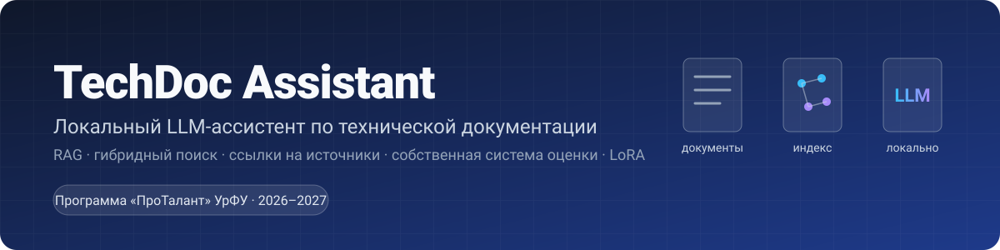
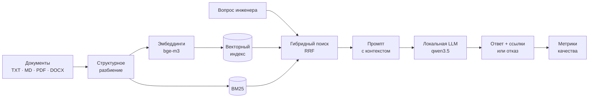

<p align="center">
  
</p>

<h1 align="center">TechDoc Assistant</h1>

<p align="center">
  Локальный LLM-ассистент по технической документации: находит ответ в руководствах и регламентах предприятия,
  ссылается на источник и честно молчит, когда ответа в документах нет. Работает полностью внутри контура — данные не уходят в облако.
</p>

<p align="center">
  <a href="https://github.com/Voldemurik/URFU-PROTALANT/actions/workflows/ci.yml"></a>
  
  
  
  <a href="LICENSE"></a>
  
</p>

<p align="center">
  <b>Проект программы <a href="https://protalant.urfu.ru/">«ПроТалант» УрФУ</a>, 2026–2027</b><br>
  Трек «Цифровое производство: промышленный ИИ, цифровые двойники и робототехника»
</p>

<p align="center">
  <a href="#быстрый-старт">Быстрый старт</a> ·
  <a href="#как-это-работает">Как это работает</a> ·
  <a href="#система-оценки-качества">Оценка качества</a> ·
  <a href="#дорожная-карта">Дорожная карта</a> ·
  <a href="docs/architecture.md">Архитектура</a> ·
  <a href="#об-авторе">Об авторе</a>
</p>

---

## Проблема

На производстве знания живут в сотнях PDF: руководства к станкам, регламенты обслуживания, инструкции по поиску неисправностей. Инженер тратит время на поиск нужного пункта, а новый сотрудник — на то, чтобы вообще понять, где искать. Облачные ассистенты для такой документации не подходят: это коммерческая тайна, а ещё они склонны уверенно выдумывать несуществующие коды ошибок и нормативы.

## Решение

**TechDoc Assistant** — система «вопрос → ответ со ссылками» на базе открытой языковой модели, которая запускается на обычном компьютере:

- **Документы не покидают машину.** Индекс, поиск и генерация — локально, через [Ollama](https://ollama.com/). Сетевой трафик — только на `localhost`.
- **Каждое утверждение — со ссылкой на источник.** Ответ выглядит как «…код E12 [1]», где [1] — конкретный документ и раздел.
- **Честный отказ вместо выдумки.** Если ответа в документации нет, модель говорит об этом одной фиксированной фразой — это измеряется.
- **Гибридный поиск.** Векторный (по смыслу) + BM25 (по точным терминам): коды ошибок, артикулы и номера пунктов не теряются.
- **Собственная система оценки.** Точность, полнота, корректность ссылок и доля галлюцинаций считаются автоматически на наборе вопросов, включая вопросы-ловушки.
- **Замкнутый цикл улучшения.** Оценка → слабые места → дообучение LoRA → повторная оценка той же системой.

## Как это работает



1. **Индексация.** Документы режутся на фрагменты по структуре (заголовки, абзацы, строки таблиц — с повторением шапки), для каждого считается эмбеддинг (числовой вектор смысла) и строится лексический индекс.
2. **Поиск.** По вопросу ищутся кандидаты в векторном индексе и в BM25; списки объединяются методом Reciprocal Rank Fusion.
3. **Генерация.** Top-k фрагментов передаются модели пронумерованными блоками. Промпт требует отвечать только по контексту, ссылаться `[n]` и отказываться при отсутствии сведений.
4. **Оценка.** Тот же пайплайн прогоняется по набору вопросов с эталонами, считаются метрики по каждому слою.

Подробно: [docs/architecture.md](docs/architecture.md).

## Быстрый старт

Нужны Python 3.10+ и [Ollama](https://ollama.com/download).

```bash
# 1. Модели (скачиваются один раз; ~7 ГБ)
ollama pull bge-m3
ollama pull qwen3.5:9b        # для слабых машин: qwen3.5:4b

# 2. Установка
git clone https://github.com/Voldemurik/URFU-PROTALANT.git
cd URFU-PROTALANT
python -m venv .venv
.venv\Scripts\activate        # Linux/macOS: source .venv/bin/activate
pip install -e ".[faiss,pdf,docx]"

# 3. Проверка окружения
techdoc doctor

# 4. Индексация и вопросы
techdoc ingest data/sample_docs
techdoc ask "Что делать при ошибке E12 на станке ФС-400?"
techdoc chat                  # интерактивный режим

# 5. Оценка качества на учебном наборе
techdoc eval data/eval/sample_qa.jsonl --judge --report-md reports/qwen9b.md
```

Так выглядит ответ `techdoc ask` (формат ответа; формулировки зависят от модели):

```
Перегреву шпинделя (температура выше 70 °C) соответствует код E12 [1].
Нужно остановить обработку, дать шпинделю остыть не менее 20 минут и
проверить систему охлаждения [1]. Если ошибка повторяется чаще двух раз
за смену, эксплуатация запрещается до проверки сервисной службой [1].

Источники:
  [1] Фрезерный станок с ЧПУ ФС-400. Руководство по эксплуатации › 5. Коды ошибок — data/sample_docs/fs400_rukovodstvo_po_ekspluatacii.md
```

<details>
<summary><b>Без Ollama и GPU</b> — посмотреть механику поиска и оценки в офлайн-режиме</summary>

Флаг `--offline` заменяет нейросетевые эмбеддинги детерминированным хэш-эмбеддером, а генерацию — экстрактивным ответом (текст лучшего фрагмента). Именно так работают тесты и CI.

```bash
techdoc ingest data/sample_docs --offline
techdoc search "перегрев шпинделя E12" --offline -k 3
techdoc eval data/eval/sample_qa.jsonl --offline --report-md reports/baseline.md
```

```
[1] Фрезерный станок с ЧПУ ФС-400. Руководство по эксплуатации › 5. Коды ошибок  (score=0.0325, dense=2 bm25=1)
    | Код | Описание | Действия оператора | |---|---|---| | E01 | Нажата кнопка аварийного останова | …
[2] Фрезерный станок с ЧПУ ФС-400. Руководство по эксплуатации › 4. Подготовка к работе и запуск  (score=0.0320, dense=1 bm25=4)
    4.1. Перед включением убедитесь, что давление в пневмосети составляет не менее 0,5 МПа, …
```
</details>

Настройки (модели, размер фрагментов, top-k) — в [`config.example.yaml`](config.example.yaml); файл передаётся флагом `-c config.yaml`.

## Система оценки качества

Ассистент, которому нельзя доверять, бесполезен на производстве, поэтому качество измеряется по слоям — и без облачных сервисов.

| Слой | Метрики | Вопрос, на который отвечают |
|---|---|---|
| Поиск | `recall@k`, `hit_rate`, `MRR` | Нашлись ли нужные документы? |
| Ответ | `token_f1`, `must_include` | Сохранились ли коды, числа, единицы измерения? |
| Ссылки | `citations/precision`, `citations/recall` | Ссылается ли модель на те документы, где ответ? |
| Галлюцинации | `trap_refusal_rate`, `false_refusal_rate`, `judge/faithfulness` | Отказывается ли на вопросах-ловушках? Не выдумывает ли? |

Учебный набор — [`data/eval/sample_qa.jsonl`](data/eval/sample_qa.jsonl): 13 вопросов по трём вымышленным промышленным документам (станок с ЧПУ, контроллер, конвейер), два из них — ловушки без ответа в документации.

Экстрактивный бейзлайн без LLM ([отчёт](reports/baseline_offline_extractive.md)): `recall@k` = 1.00, `must_include` = 0.68, `citations/precision` = 1.00, `trap_refusal_rate` = **0.00** — бейзлайн не умеет отказываться, и именно здесь языковая модель должна дать основной выигрыш.

Система уже окупилась на первом же эксперименте: индексация названий документа и раздела вместе с текстом фрагмента подняла `must_include` с 0.46 до 0.68, а `citations/precision` — с 0.82 до 1.00 на том же наборе. Результаты с реальными моделями заполняются по ходу этапа 1 в [docs/evaluation.md](docs/evaluation.md).

## Структура репозитория

```
URFU-PROTALANT/
├── src/techdoc_assistant/     # пакет
│   ├── loaders.py             #   чтение TXT/MD/PDF/DOCX (с перебором кодировок)
│   ├── chunking.py            #   структурное разбиение: заголовки, абзацы, таблицы
│   ├── embeddings.py          #   эмбеддинги: Ollama + офлайн-заглушка
│   ├── vector_store.py        #   векторный индекс (FAISS / NumPy), сохранение на диск
│   ├── lexical.py             #   BM25 на чистом Python
│   ├── retriever.py           #   гибридный поиск, Reciprocal Rank Fusion
│   ├── prompts.py             #   промпты ассистента и LLM-судьи
│   ├── rag.py                 #   пайплайн: ingest / ask, извлечение ссылок
│   ├── evaluation/            #   набор данных, метрики, судья, прогон и отчёты
│   └── cli.py                 #   команды techdoc
├── data/sample_docs/          # учебные документы (вымышленные)
├── data/eval/sample_qa.jsonl  # оценочные вопросы
├── training/                  # контур дообучения LoRA (этап 2)
├── docs/                      # архитектура, оценка, дорожная карта, обзор аналогов
├── reports/                   # отчёты techdoc eval
├── tests/                     # тесты (без Ollama и GPU)
└── .github/workflows/ci.yml   # ruff + pytest + smoke-тест CLI
```

## Дорожная карта

| Этап | Сроки | Что делаем | Статус |
|---|---|---|---|
| 0. Заявка и MVP | август – 7 сентября 2026 | Пайплайн, система оценки, учебный корпус, CI | ✅ |
| 1. Исследование | сентябрь 2026 – 25 января 2027 | Реальная документация партнёра, оценочный набор 100+ вопросов, разбор PDF, сравнение моделей, переранжирование, борьба с галлюцинациями | ⏳ |
| Промежуточная защита | 26–29 января 2027 | Отчёт с метриками до/после, демо | |
| 2. Продукт | 1 февраля – 20 июня 2027 | Дообучение LoRA, веб-интерфейс, развёртывание в контуре, пилот у партнёра | |
| Финал | конец июня 2027 | Публичная защита | |

Детали, вехи и риски — в [docs/roadmap.md](docs/roadmap.md).

## Технологии

| Компонент | Выбор | Почему |
|---|---|---|
| Язык | Python 3.10+ | стандарт для ML, минимум зависимостей: `numpy`, `requests`, `PyYAML` |
| Запуск моделей | [Ollama](https://ollama.com/) | одна команда для установки и запуска LLM на CPU/GPU, HTTP API |
| LLM | `qwen3.5:9b` (по умолчанию), `qwen3.5:4b`, `gemma4:12b` | сильный русский, длинный контекст, работают на потребительских GPU |
| Эмбеддинги | `bge-m3` | многоязычная, проверена на русском; альтернатива `qwen3-embedding` |
| Векторный поиск | FAISS (`IndexFlatIP`) или NumPy | точный поиск, нулевая инфраструктура |
| Лексический поиск | BM25 (свой, ~100 строк) | прозрачность; точные коды и артикулы |
| Дообучение | `peft` + `transformers` (LoRA/QLoRA) | адаптер в десятки МБ, обучение на одной GPU |
| Качество кода | `ruff`, `pytest`, GitHub Actions | проверки при каждом push и pull request |

## Документация

- [Архитектура](docs/architecture.md) — компоненты, решения, требования к железу, точки расширения
- [Система оценки](docs/evaluation.md) — формат набора, формулы метрик, протокол эксперимента
- [Дорожная карта](docs/roadmap.md) — вехи по этапам программы, риски
- [Обзор аналогов](docs/related-work.md) — чем отличаемся от PrivateGPT, AnythingLLM, RAGFlow и др.
- [Дообучение LoRA](training/README.md) — от набора данных до подключения адаптера в Ollama
- [Как участвовать](CONTRIBUTING.md) · [История изменений](CHANGELOG.md)

## О программе «ПроТалант»

[Программа выявления и поддержки талантливых первокурсников УрФУ](https://protalant.urfu.ru/): первокурсники с высокими результатами ЕГЭ или олимпиад реализуют проект под руководством наставника по одному из тематических треков. Этап 1 — до 25 января (консультации раз в две недели, промежуточная защита), этап 2 — до 20 июня (финальный продукт, публичная защита).

## Об авторе

**Voldemurik** — первокурсник УрФУ, 2026 год поступления. GitHub: [@Voldemurik](https://github.com/Voldemurik).

<details>
<summary><b>Индивидуальные достижения</b></summary>

- Всероссийская олимпиада школьников по математике — участие на школьном и муниципальном этапах с 4 по 11 класс.
- Олимпиадные кружки (курсы) по информатике и математике на базе СУНЦ УрФУ, 9–11 классы, в том числе авторские курсы А. А. Коновалова по математике (11 класс).
- Олимпиада «Изумруд» (2025/2026) — выход в очный этап по профильным предметам.
- Участие в «Пик-IT» (2025).
- Дважды высокобалльник (90+) ЕГЭ по профильным предметам.
- Английский язык — уровень B1 (Cambridge Preliminary).
- Уверенное владение Python.
- Аттестат с отличием и медаль «За особые успехи в учении» I степени.
</details>

## Лицензия

[MIT](LICENSE). Учебные документы в `data/sample_docs/` вымышлены и не описывают реальное оборудование.

Проект реализуется с использованием нейронных сетей Claude, GigaChat, YandexGPT.
