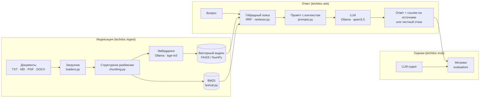

# Архитектура

Система отвечает на вопросы по технической документации предприятия, не выпуская
данные за пределы локальной машины. Это классический RAG (Retrieval-Augmented
Generation): сначала находим релевантные фрагменты документов, затем просим
языковую модель ответить строго по ним и сослаться на источники.

## Общая схема

## Компоненты

### Загрузка документов — `loaders.py`

Поддерживаются `.txt`, `.md`, `.rst`, `.pdf` (через `pypdf`) и `.docx` (через
`python-docx`). Зависимости для PDF и DOCX необязательные: без них файлы
пропускаются с предупреждением. Текстовые файлы читаются с перебором кодировок
(UTF-8 → CP1251 → KOI8-R), потому что документация на предприятиях нередко хранится
в старых Windows-кодировках.

### Разбиение на фрагменты — `chunking.py`

Слепое разбиение по N символов рвёт таблицы и списки и теряет контекст. Поэтому
разбиение *структурное*:

1. Текст делится на заголовки и абзацы.
2. Абзацы склеиваются в фрагменты до `chunk_size` символов (по умолчанию 900)
   с перекрытием `chunk_overlap` (150) — чтобы мысль на границе не потерялась.
3. Для каждого фрагмента запоминается ближайший заголовок раздела: ссылка выглядит
   как «Руководство ФС-400 › 5. Коды ошибок», а не просто «фрагмент №17».
4. Длинные блоки режутся по строкам (таблицы, списки), затем по предложениям.
   **Шапка Markdown-таблицы повторяется в каждом куске**, поэтому строка
   `| E12 | Перегрев шпинделя | …` остаётся понятной и модели, и человеку.

### Эмбеддинги — `embeddings.py`

Эмбеддинг — числовой вектор, кодирующий смысл текста; близкие по смыслу тексты
дают близкие векторы. Используется многоязычная модель `bge-m3` через Ollama
(альтернативы: `qwen3-embedding`, `nomic-embed-text-v2-moe`). Интерфейс
`Embedder` — один метод `embed(texts) -> матрица`, поэтому модель заменяется без
правок остального кода. `HashingEmbedder` — детерминированная замена без
нейросети для тестов и запуска на машинах без Ollama.

### Индекс — `vector_store.py`, `lexical.py`

Векторы L2-нормируются, поиск ведётся по косинусной близости. При наличии
`faiss-cpu` используется `IndexFlatIP`, иначе — точное произведение матриц в NumPy
(для десятков тысяч фрагментов этого достаточно). Индекс сохраняется в три файла:
`vectors.npy`, `chunks.jsonl`, `meta.json` — всё читаемо и переносимо.

Параллельно строится BM25 — классический лексический индекс. Он нужен, потому что
векторный поиск плохо различает точные обозначения: коды ошибок, артикулы, номера
пунктов. Токенизация простая (слова в нижнем регистре, ё → е); морфологическая
нормализация — в планах.

### Гибридный поиск — `retriever.py`

Результаты двух поисков объединяются методом Reciprocal Rank Fusion:
`score = Σ 1 / (k + rank_i)`, k = 60. RRF не требует нормировки несопоставимых
скоров и устойчиво улучшает выдачу. Каждый результат хранит оба ранга и «сырые»
скоры — это видно в `techdoc search` и помогает отлаживать поиск.

### Генерация — `prompts.py`, `llm.py`, `rag.py`

Системный промпт задаёт пять правил: отвечать только по контексту, ставить ссылку
`[n]` после каждого утверждения, при отсутствии сведений отвечать фиксированной
фразой-отказом, сохранять точные значения и единицы, отвечать по-русски. Фрагменты
передаются пронумерованными блоками с подписью источника. Из ответа извлекаются
ссылки `[n]` и сопоставляются с фрагментами → объект `Answer` с цитатами и флагом
`refused`.

Модель по умолчанию — `qwen3.5:9b` (режим рассуждений выключен: `think: false`,
температура 0.1). Клиент Ollama написан на голом `requests` — без SDK и «магии»,
каждый запрос прозрачен.

### Оценка — `evaluation/`

Описана отдельно: [evaluation.md](evaluation.md).

## Хранение и приватность

- Документы, индекс и модели живут на локальном диске; сетевые запросы идут только
  на `localhost:11434` (Ollama).
- Телеметрии нет. Единственное скачивание — весов моделей командой `ollama pull`,
  один раз.
- Документация партнёров хранится в `data/private/` и не попадает в git.

## Требования к железу

| Конфигурация | Модель | Что ожидать |
|---|---|---|
| Ноутбук, только CPU, 16 ГБ ОЗУ | `qwen3.5:4b` + `bge-m3` | Индексация быстрая; ответ 20–60 с |
| GPU 8–12 ГБ (RTX 3060/4060) | `qwen3.5:9b` | Ответ 3–10 с |
| GPU 24 ГБ (RTX 3090/4090) | `qwen3.5:27b`, `gemma4:12b` | Лучшее качество, ответ 5–15 с |

Оценки ориентировочные; точные цифры появятся в `docs/evaluation.md` по мере экспериментов.

## Точки расширения

- **Другой движок LLM** (llama.cpp, vLLM, LM Studio): реализовать класс с методом
  `generate(system, user)`.
- **Переранжирование**: кросс-энкодер (`bge-reranker-v2-m3`) поверх кандидатов RRF.
- **Морфология**: стемминг/лемматизация в `lexical.tokenize` для русского.
- **Интерфейс**: веб-чат на FastAPI/Gradio поверх `RagPipeline`.
- **Дообучение**: контур LoRA в `training/`.
