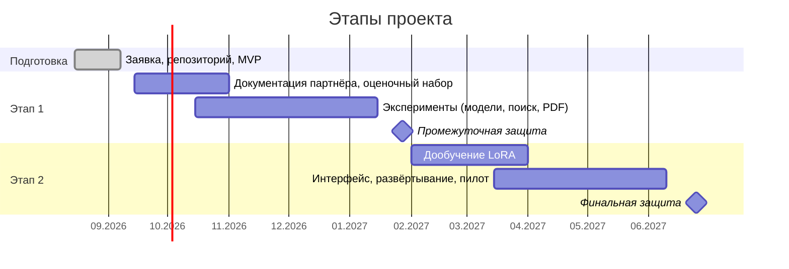

# Дорожная карта

План привязан к этапам программы «ПроТалант» УрФУ 2026–2027
([protalant.urfu.ru](https://protalant.urfu.ru/)).

## Этап 0 — заявка и MVP (август – 7 сентября 2026)

- [x] Идея, трек «Цифровое производство: промышленный ИИ, цифровые двойники и робототехника»
- [x] Репозиторий, структура проекта, лицензия, CI
- [x] RAG-пайплайн: загрузка → структурный чанкинг → гибридный поиск → ответ со ссылками
- [x] Система оценки с метриками поиска, ответа, ссылок и галлюцинаций; экстрактивный бейзлайн
- [x] Учебный корпус (3 вымышленных промышленных документа) и 13 оценочных вопросов
- [x] Контур дообучения LoRA (сборка набора, скрипт, dry-run)
- [ ] Подача заявки до 7 сентября, результаты отбора — 11 сентября

## Этап 1 — исследование (сентябрь 2026 – 25 января 2027)

Раз в две недели — консультация с наставником и отчёт о прогрессе.

| # | Веха | Результат | Как измеряем |
|---|---|---|---|
| 1.1 | Реальная документация | Договорённость с индустриальным партнёром/кафедрой, корпус 50–200 документов в `data/private/` | объём корпуса, форматы |
| 1.2 | Оценочный набор | 100+ вопросов с эталонами и ловушками, составленных с инженерами | размер, доля ловушек |
| 1.3 | Качество PDF | Таблицы, сканы (OCR), колонтитулы, многоколоночная вёрстка, номер страницы в ссылке | `retrieval/recall@k` на PDF-вопросах |
| 1.4 | Сравнение моделей | qwen3.5 4b/9b/27b, gemma4, gpt-oss; эмбеддинги bge-m3 vs qwen3-embedding | таблица в `docs/evaluation.md` |
| 1.5 | Улучшение поиска | Переранжирование кросс-энкодером, морфология для BM25, подбор chunk_size/top_k | recall@k, mrr, must_include |
| 1.6 | Борьба с галлюцинациями | Промпт-инжиниринг, проверка ответа вторым проходом, порог уверенности | trap_refusal_rate ↑, false_refusal_rate ↓ |
| 1.7 | Промежуточная защита (26–29 января) | Отчёт с метриками до/после, демо | — |

## Этап 2 — продукт (1 февраля – 20 июня 2027)

| # | Веха | Результат |
|---|---|---|
| 2.1 | Дообучение LoRA | Адаптер на 300+ примерах; сравнение метрик до/после на отложенной выборке |
| 2.2 | Интерфейс | Веб-чат (FastAPI + простой фронтенд или Gradio): ответ, подсветка источников, обратная связь «ответ верный / неверный» |
| 2.3 | Развёртывание | Docker-compose с Ollama, инструкция по установке внутри контура, требования к железу |
| 2.4 | Пилот | Опытная эксплуатация у партнёра, сбор реальных вопросов, дообучение на них |
| 2.5 | Финал (конец июня) | Публичная защита: продукт, метрики, отзыв партнёра |

## Идеи на потом

- Многошаговый поиск (переформулировка вопроса моделью, «уточняющие» запросы).
- Работа с чертежами и схемами через мультимодальные модели (qwen3.5 и gemma4 умеют читать изображения).
- Интеграция с системами предприятия (Confluence/СЭД) для автоматической переиндексации.
- Режим «объясни как новичку» для обучения новых сотрудников.

## Риски и что с ними делать

| Риск | Действие |
|---|---|
| Не удастся получить реальную документацию | Публичные ГОСТы, руководства с сайтов производителей, документация открытых проектов (например, открытой системы ЧПУ LinuxCNC) |
| Слабое железо для 9B-моделей | Модели 4B, квантование, CPU-режим; облачные GPU только для обучения адаптера, без данных партнёра |
| LLM-судья ненадёжен | Опора на «жёсткие» метрики (ловушки, обязательные факты, ссылки), ручная проверка выборки |
| Дообучение ухудшит модель | Сравнение на отложенной выборке, откат к базовой модели, адаптер как опция |
